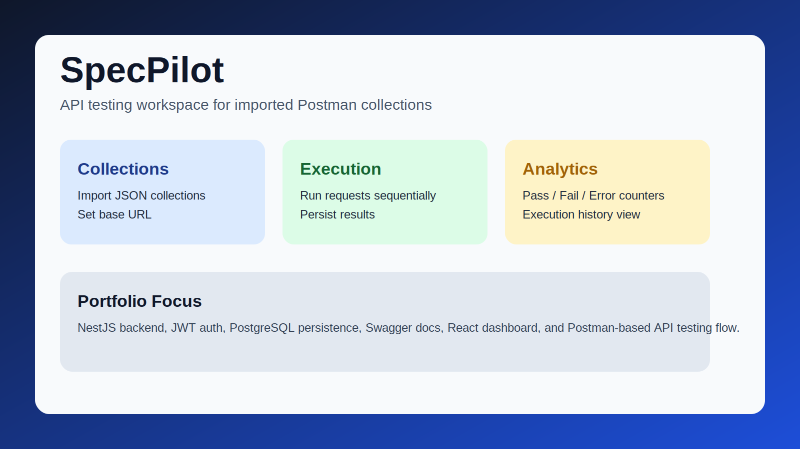
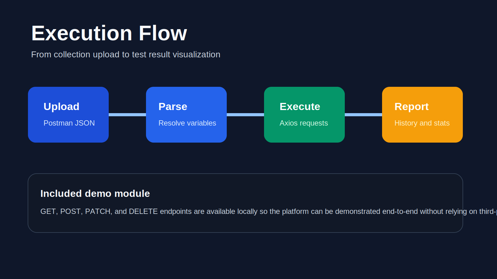
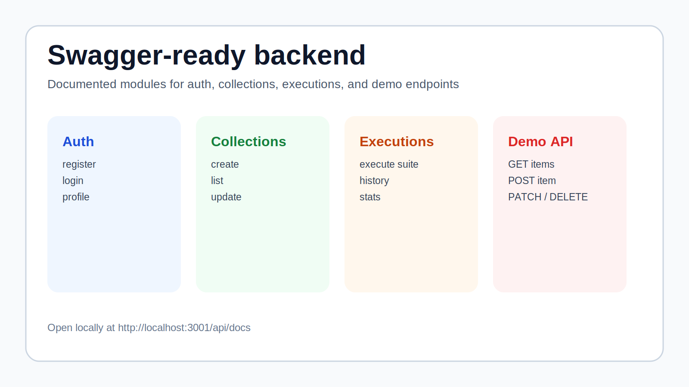

# SpecPilot

O SpecPilot e uma plataforma de testes de API pensada para portfólio, focada em importar collections do Postman, executar suites de requests e visualizar o histórico das execuções em uma interface web simples.

O projeto foi construído como um MVP full stack para demonstrar visão de produto, arquitetura de backend, fluxos autenticados, desenvolvimento guiado por Swagger e uma interface prática para automação orientada a QA.

## Destaques

- Importação de collections do Postman em JSON
- Autenticação de usuários com JWT
- Persistência de collections e histórico de execuções em PostgreSQL
- Execução de requests diretamente a partir das collections importadas
- Visualização de aprovados, falhas e erros
- Exploração e teste de endpoints do backend com Swagger
- Módulo CRUD de demonstração para uso local e apresentação do projeto

## Stack Tecnológica

- Frontend: React 18, TypeScript, Vite, Zustand, Tailwind CSS
- Backend: NestJS, TypeORM, PostgreSQL, JWT, Swagger
- Ferramentas: Docker Compose, ESLint, Prettier

## Capturas de Tela

Estes assets de portfólio já estão incluídos no repositório e podem ser usados em previews no GitHub ou páginas de case.





## Fluxo do Produto

1. Registrar ou fazer login
2. Enviar uma collection do Postman
3. Configurar uma base URL opcional
4. Executar os requests importados
5. Revisar histórico, status HTTP e resultados da execução

## Endpoints de Demonstração

O projeto inclui um módulo simples para apresentação local e testes:

```text
GET    /api/demo-items
GET    /api/demo-items/:id
POST   /api/demo-items
PATCH  /api/demo-items/:id
DELETE /api/demo-items/:id
```

A documentação Swagger fica disponível em [http://localhost:3001/api/docs](http://localhost:3001/api/docs).

## Configuração Local

```bash
# 1. Subir o PostgreSQL
# Reaproveita um container local `testaix-postgres` quando ele já existir
npm run db:up

# 2. Configurar ambiente do backend
cp backend/.env.example backend/.env

# 3. Configurar ambiente do frontend
cp frontend/.env.example frontend/.env

# 4. Rodar backend
cd backend
npm install
npm run start:dev

# 5. Rodar frontend
cd ../frontend
npm install
npm run dev
```

URLs da aplicação:

- Frontend: `http://localhost:3002`
- Backend: `http://localhost:3001`
- Swagger: `http://localhost:3001/api/docs`

## Observações Para Portfólio

Este repositório pode ser publicado com segurança como projeto de portfólio, com uma regra importante: não versionar arquivos `.env` locais.

- Mantenha `backend/.env` e `frontend/.env` apenas no ambiente local
- Use `*.env.example` como templates públicos de configuração
- Credenciais como `postgres/postgres` existem apenas como placeholders de desenvolvimento
- Troque qualquer segredo imediatamente se ele tiver sido usado em um ambiente real

## Estrutura do Repositório

```text
SpecPilot/
|-- backend/
|   |-- src/modules/auth
|   |-- src/modules/collections
|   |-- src/modules/demo-items
|   `-- src/modules/test-executions
|-- frontend/
|   |-- src/pages
|   |-- src/services
|   `-- src/stores
|-- docs/
|   |-- screenshots/
|   `-- *.json
|-- docker-compose.yml
`-- README.md
```

## Por Que Este Projeto Importa

O SpecPilot e um bom projeto de portfólio porque combina:

- autenticação real e rotas protegidas
- persistência em banco de dados
- lógica de execução de APIs em estilo assíncrono
- desenvolvimento de backend orientado por documentação
- casos de uso práticos para QA e experiência de desenvolvedor

## Autor

Jefferson Reis
